# Survey Website with gamification system

This project is a web-based system where users can manage reviews and surveys. The system includes a login page for authentication and authorization to ensure only authenticated users can create, edit, or delete reviews and surveys.

## Table of Contents

- [Features](#features)
- [Technologies Used](#technologies-used)
- [Setup Instructions](#setup-instructions)
- [Usage](#usage)
- [API Endpoints](#api-endpoints)

## Features

- **User Authentication:** Only authenticated users can create, edit, or delete reviews and surveys.
- **Review and Survey Display:** All users can view the list of reviews, on the other hand, only authenticated users can view survey questions.
- **Dynamic Updates:** Reviews and surveys are dynamically updated without refreshing the page.
- **An authenticated user can create an eco-cadet account for further gamification features such as purchasing seeds with the reward points from answering survey questions,     growing seeds, watering seeds and exchanging rewards earned from these actions. 
- **Modal-based Interface:** Create, edit, and delete operations are handled through modals.

## Technologies Used

- **Frontend:** HTML, CSS, JavaScript, Bootstrap
- **Backend:** Node.js, Express.js
- **Database:** MySQL
- **Authentication:** JWT (JSON Web Token)
- **API Calls:** Fetch API

## Setup Instructions

1. **Clone the repository:**
    ```bash
    git clone https://github.com/whoisAKchaik/Full-Stack-Web-Development.git
    cd Full-Stack-Web-Development
    ```

2. **Install dependencies:**
    ```bash
    npm install
    ```

3. **Set up environment variables:** Create a `.env` file in the root directory and add the following variables:
    ```makefile
    DB_HOST=your_database_host
    DB_USER=your_database_user
    DB_PASSWORD=your_database_password
    DB_NAME=your_database_name
    JWT_SECRET_KEY=your_jwt_secret
    JWT_EXPIRES_IN=15m
    JWT_ALGORITHM=HS256
    ```

4. **Run the server:**
    ```bash
    npm start
    ```

5. **Open the application in your browser:** Navigate to `http://localhost:3000`.

## Usage

### Viewing Reviews and Surveys

Authenticated users can view the list of surveys on the main page and all users can view a list of reviews on the review page.

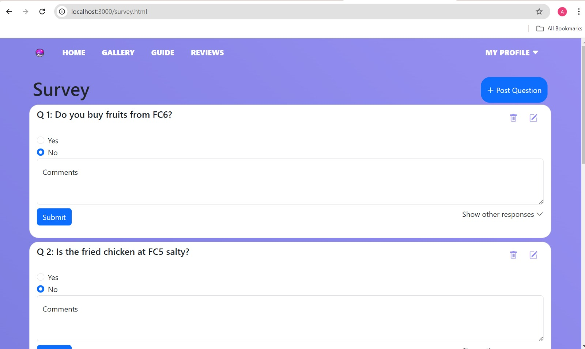

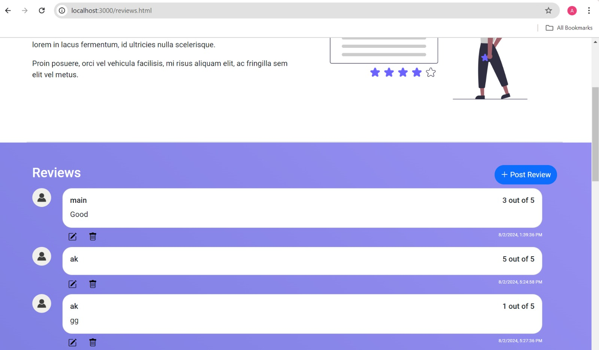


### Creating a Review or Survey

1. Click the "Post Review" or "Post Questions" button.
2. Fill in the necessary details.
3. Click the "Confirm" button.

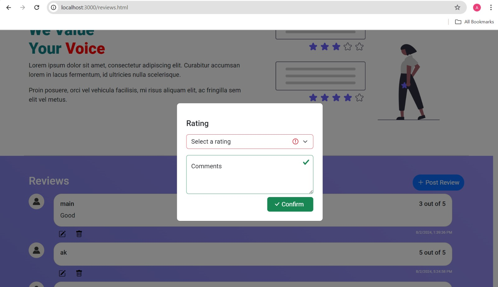

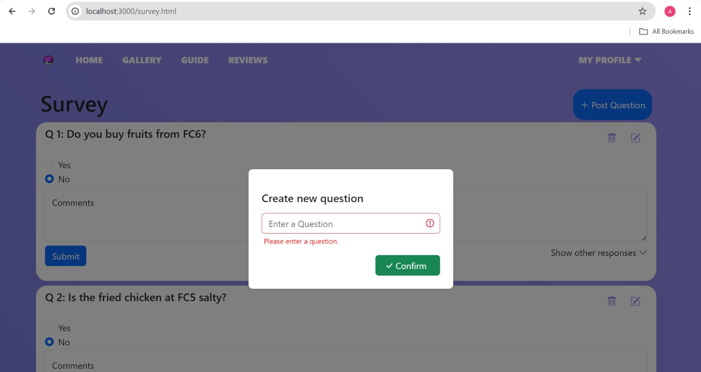


### Editing a Review or Survey

1. Click the pencil icon next to the review or survey you want to edit.
2. Update the details in the modal.
3. Click the "Confirm" button.
4. Only the owner of the particular reviews or survey questions can do edition.

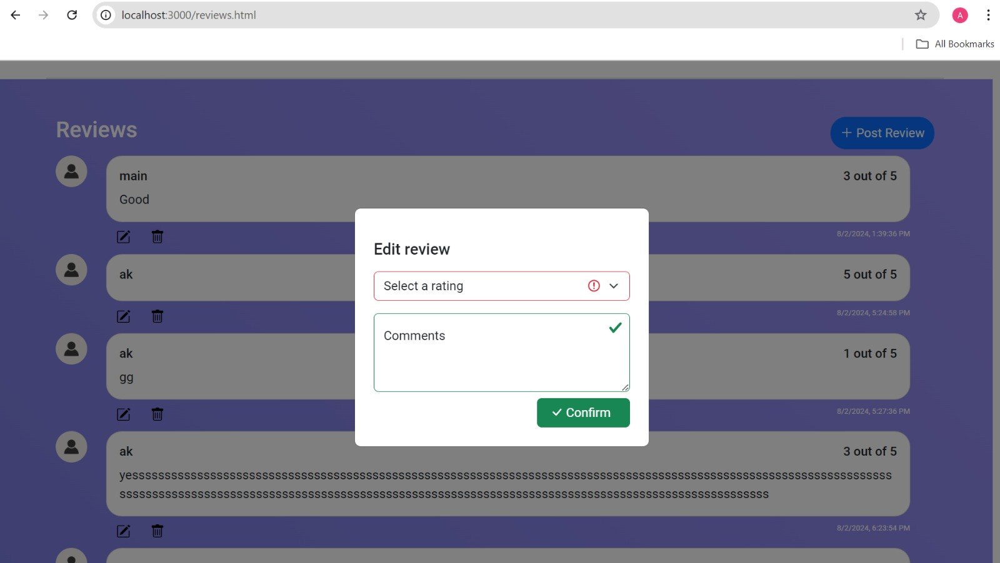

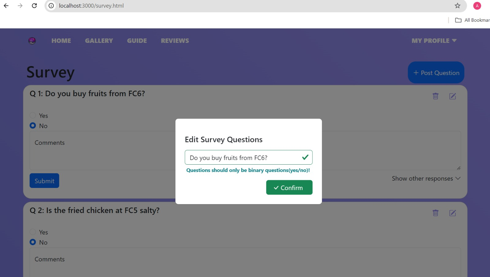


### Deleting a Review or Survey

1. Click the trash icon next to the review or survey you want to delete.
2. Confirm the deletion in the modal by clicking the "Confirm" button.
3. Only the owner of the particular reviews or survey questions can do deletion.

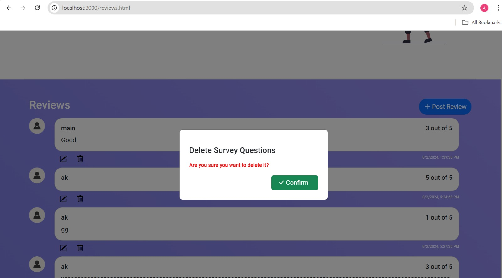

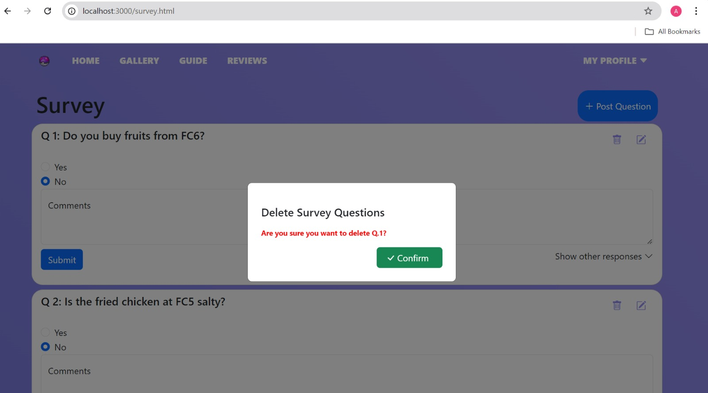

### Authentication

- Users must be logged in to create, edit, or delete reviews and surveys.
- If a user tries to perform any of these actions without being logged in, they will be redirected to the login page.

### Viewing User's profile

Authenticated users can view the user's profile and eco-cadet's account if exits, on the profile page.

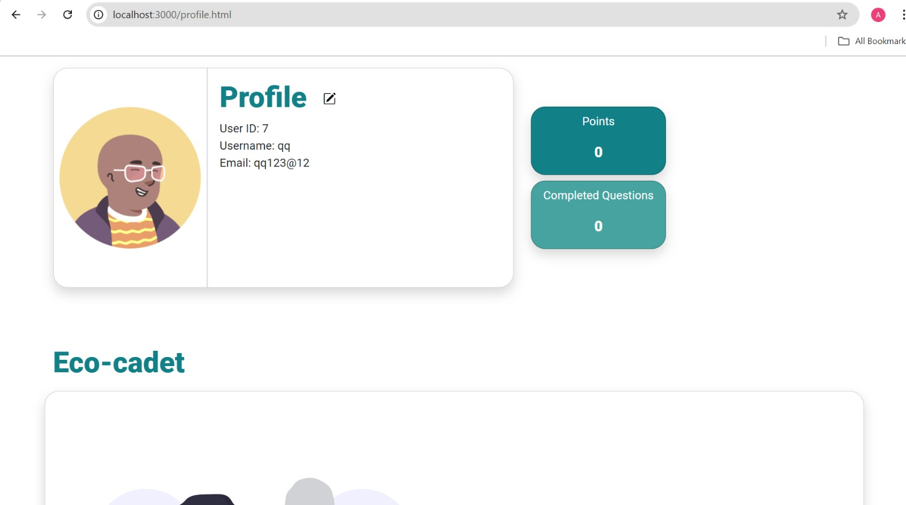

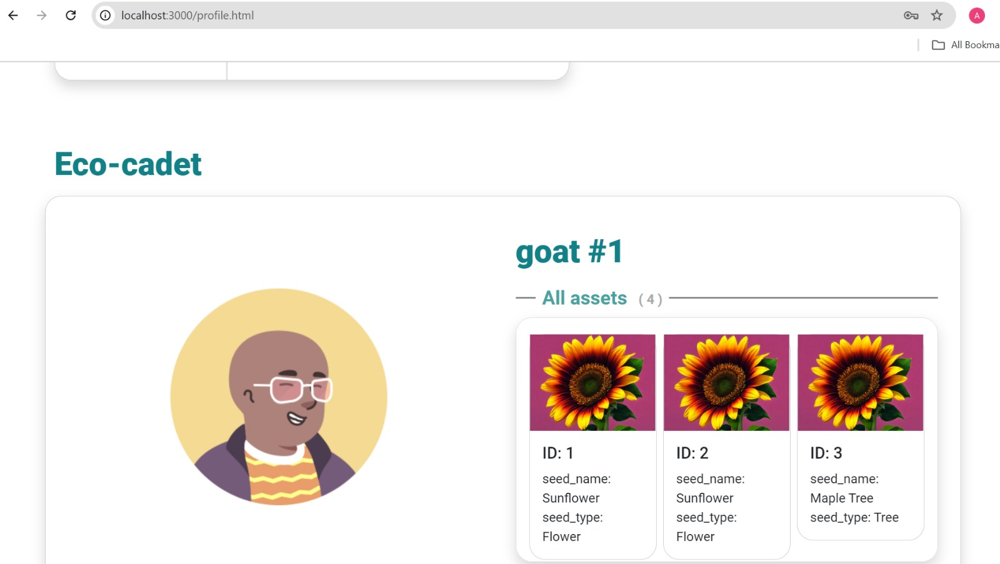

### Creating an eco-cadet profile

1. Click the "Go" button next to "Be the Game Changer Today".
2. Fill in the necessary details.
3. Click the "Confirm" button.

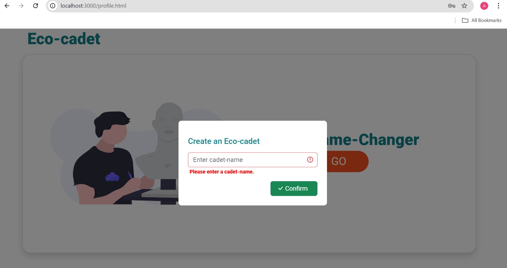

### Editing an eco-cadet profile

1. Click the the pencil icon next to the eco-cadet's name.
2. Fill in the necessary details.
3. Click the "Confirm" button.

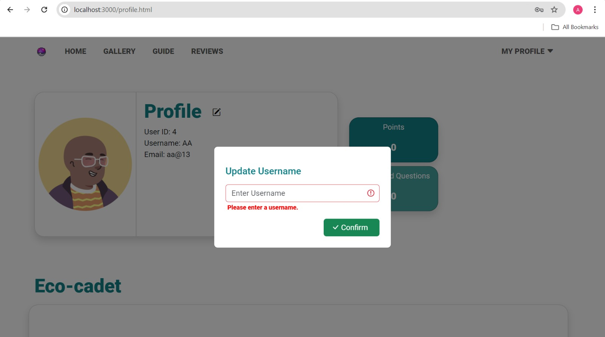

## API Endpoints

- **POST /api/register**: Create a new user.
- **POST /api/login**: User Login.
- **POST /api/user_id/ecoCadet**: Create a new eco-cadet account. (Authentication required)
- **POST /api/user_id/ecoCadet/cadet_id**: Edit eco-cadet name. (Authentication required)
- **GET /api/reviews**: Fetch all reviews.
- **POST /api/reviews**: Create a new review. (Authentication required)
- **PUT /api/reviews/:id**: Edit a review by ID. (Authentication required)
- **DELETE /api/reviews/:id**: Delete a review by ID. (Authentication required)
- **GET /api/questions**: Fetch all surveys.
- **POST /api/questions**: Create a new survey. (Authentication required)
- **PUT /api/questions/:id**: Edit a survey by ID. (Authentication required)
- **DELETE /api/questions/:id**: Delete a survey by ID. (Authentication required)


